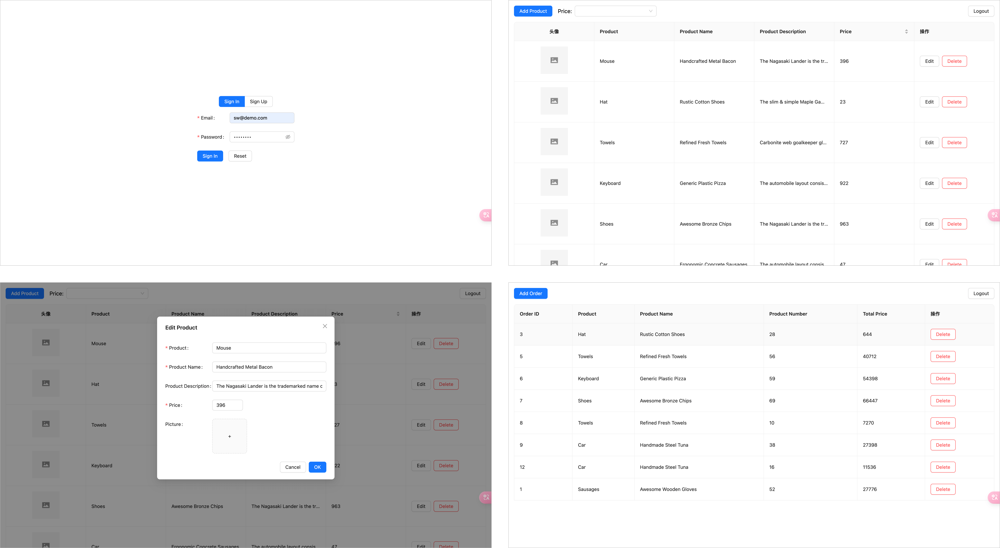

# Supabse-demo

当我们在进行一个应用开发的时候，通常需要前端和后端紧密协作来进行功能的开发。然而，当一个前端想要独立开发应用的时候，后端开发的语言和逻辑可能是一片陌生的领域，这就会导致项目充满挑战甚至无法开展，前端必须先去了解相关领域的知识才能继续推进。尽管我们能够使用 Node.js 等技术来进行后端开发，但依旧存在额外的复杂性和学习曲线。幸运的是，Supabase 的出现为前端开发者提供了一种全新的全栈开发方式 🎉 Supabase 不仅提供了数据库服务，也是一个全功能的后端服务平台。通过 Supabase，我们不再受限于传统的前后端分离模式，无需编写复杂的后端逻辑，可以直接在前端代码中进行数据库操作。本项目包括数据库的增删改查、用户认证、文件存储、实时订阅等功能，让我们一起开始探索 Supabase 带来的无限可能吧 🏄

使用技术栈：

- react
- supabase
- ant-design
- tailwindcss
- react query
- react router

完整内容请阅读：

- [手把手教你Supabase，让前端轻松搞定后端 😉（上）](https://juejin.cn/spost/7393533304504713267)
- [手把手教你Supabase，让前端轻松搞定后端 😉（下）](https://juejin.cn/spost/7393533304504746035)
